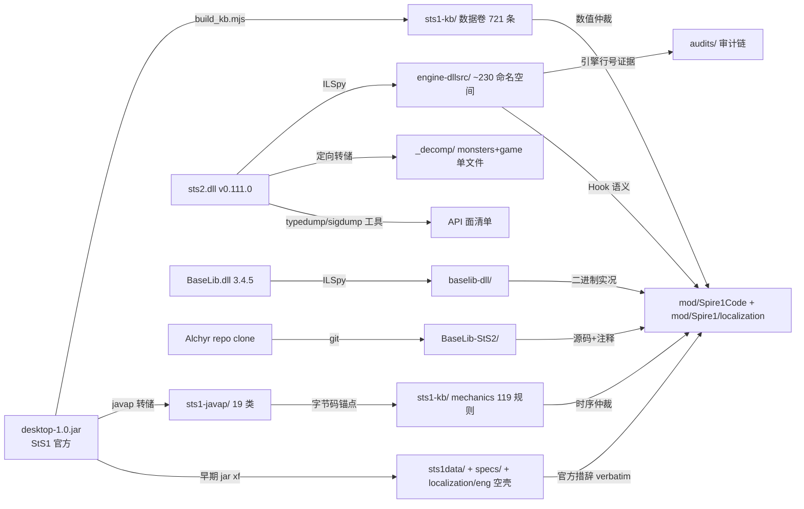

# 研究资产盘点 — research/ 全目录（inventory-research）

> 生成：2026-08-28。方法：只读调研——每个子目录实际打开关键文件核验内容形态与规模，不凭目录名臆测。
> 用途：六个月后的维护者（或新 subagent）在 30 秒内判断"该查哪个目录"。每节含：形态 / 规模 / 用途 / 关键文件 / 何时查它。
> 阅读原则：**数值/引擎行为查反编译卷，项目踩坑查 kb/，历史决策查 audits/，StS1 原始真值查 sts1-kb/。**

---

## 1. sts1-kb/ — StS1 一代权威知识库（两卷）

| 维度 | 内容 |
|---|---|
| **形态** | 第一卷·数据：12 个 JSON（卡/遗物/药水/事件，en+zhs 双语照录）；第二卷·机制：`mechanics/` 7 个 md + README |
| **规模** | 数据卷 **721 条**（卡 438：红 75/绿 75/蓝 75/紫 77/无色 39/诅咒 14/状态 5/临时 9/选项 5/废弃 64；遗物 186；药水 43；事件 54）；机制卷 **119 条编号规则**（action-manager 20 / turn-phase 18 / draw-exhaust 25 / triggers 18 / damage-pipeline 17 / status-stacking 21）+ keys-and-final-act（钥匙与第四层，无 R 编号） |
| **用途** | VANILLA ONLY 契约的权威源：所有一代数值以 `desktop-1.0.jar` 字节码为准，文本为官方 loc 原文照录。移植仲裁时引用格式 `文件名 Rnn`（如 draw-exhaust.md R12） |
| **关键文件** | `README.md`（schema+统计+边界情况：Impulse 无 loc、Blood for Blood 分支、-1=X 费语义、keywords 启发式说明）；`build_kb.mjs`（381 行纯 Node 零依赖提取器：自带 ZIP/JVM class 解析器+线性栈模拟，直接读 jar 字节码抽 super() 实参与 upgrade() 费用操作，拼合 loc 双语；对账命令 `node build_kb.mjs <jar路径>`）；`mechanics/README.md`（119 规则索引+8 条勘误+StS1↔StS2 差异速记表） |
| **何时查** | 任何"StS1 官方数值/文本是什么"的疑问；两个 hook 谁先触发；写新卡前查同款官方描述。**与 wiki 冲突以本库为准** |

---

## 2. kb/ — 项目事实卷（本文件所在目录）

| 维度 | 内容 |
|---|---|
| **形态** | 7 个主题 md，每文件一个领域 |
| **规模** | engine-facts 4 域速查 / pitfalls P-01..P-10 模式 / debug-protocols 5 节 SOP / aftp-interop 许可证+拓扑+问题清单 / defect-pool-case 全案档案 / loc-drift-report 318 条对账 / README 索引 |
| **用途** | "skill 放方法，KB 放事实"——只存"下次还会用到的事实"，不存流程 |
| **关键文件** | 见下表 |
| **何时查** | 写补丁前查 engine-facts 是否已有结论；修完 bug 查 pitfalls 是否同模式；取证时照 debug-protocols 走 |

各文件一句话主题：

| 文件 | 主题 |
|---|---|
| `engine-facts.md` | StS2 引擎行为速查表：卡牌模型（LocalKeywords 缓存/CanonicalKeywords 必须 public override/池注入冻结时机）、联机（握手三道闸/ModelID 哈希/失同步假阳性）、部署（CopyToModsFolderOnBuild/pck 打包）、日志取证（位置/轮转/RitsuLib 转储） |
| `pitfalls.md` | 陷阱模式库 P-01..P-10：每条症状/根因/修复/预防四段式——关键词双重渲染、谓词取反、池默认继承、补丁未门控、`.Wait()` 死锁、清单版本被构建覆盖、浮动依赖、日志轮转吞现场、tasklist 假阳性、初始化日志 sink 未挂载（未解）；附 2026-08-25 编译告警普查基线（CS8602×326 等） |
| `debug-protocols.md` | 取证 SOP：火堆黑屏冻结协议（先 robocopy logs 再杀进程）、RitsuLib divergence zip 对拍读法、覆盖 drain 夜间管线、控制台速用、良性噪音清单（勿误报） |
| `aftp-interop.md` | AFTP 互操作档案：许可证结论（主仓无 License=保留所有权利、MPBalance=MIT）、fork 拓扑（Twelve-eight 双仓+本地克隆）、构建移植记录、问题清单（火堆黑屏/转场卡死/MP 失同步三案/小游戏停摆/BaseLib 版本漂移）、验证阻塞（无实机靶场） |
| `defect-pool-case.md` | 案例档案：故障机器人卡牌池贫瘠 bug 全案（三层叠加根因：冻结时机+复用缺失+误退役；修复 8781855 后覆盖 63/63；三道闸预防机制） |
| `loc-drift-report.md` | 本地化漂移报告：我方 318 条卡描述 vs 官方 KB 相似度对账（274 命中/44 未命中），A/B/C 分级判读指南 + 相似度最低 30 条人工复核队列（INJURY/CLUMSY/ASCENDERS_BANE 0% 等） |
| `README.md` | 本目录索引表 + "skill 放方法，KB 放事实"原则 |
| `inventory/`（本文件） | research/ 全子目录导航 |

---

## 3. audits/ — 审计与监视报告归档

| 维度 | 内容 |
|---|---|
| **形态** | 16 个带日期的 md 报告 + `watch-20260827/` 子目录（监视简报集） |
| **规模** | 2026-08-25 至 08-27 三天密度；单文件 1.6KB–22KB |
| **用途** | 历史决策与结论的可信度档案：每份审计都带证据链（文件:行号/git hash/javap 锚点）。**读 DEVLOG 遇到可疑声明时来这里交叉核验** |
| **关键文件** | 见下表 |
| **何时查** | 质疑某条"已修复"声明；想了解某 bug 的完整归因史；评估 DEVLOG 可信度 |

各报告一句话结论：

| 文件 | 一句话结论 |
|---|---|
| `critique-20260825.md` | 零上下文静态批判审查：17 条问题（P1×2 商店守卫未门控+联机放行默认开，P2×7 含 LessonLearned 谓词取反/跳过按钮三缺陷，P3×8）——P1 均已修，P2 大半修或入队 |
| `devlog-audit-20260825.md` | DEVLOG 全量核查：27 条需求追踪+45 条结论验证，**无虚报**，但 5 处文档滞后（C1-C5）如 zhs 遗物表当时仍为空 |
| `morning-summary-20260825.md` | 08-25 夜间总账：F1-F12 十二修复全推送 + 三知识库落库 + AFTP 线结论（火堆黑屏机制链锁定 NRestSiteRoom._Ready L321-324）+ 遗留移交表 |
| `freeze-review-20260826.md` | 停止开发审查总报告（HEAD=5358e41）：High×4 实锤（Register() 孪生注入丢失/MpIgnoreModDiffPatch 缺 ref/RestSite 救援无效/三个死开关）+ Med×8 + Low×8；历史声明复查确认修复真实性但"修复完整性系统性偏弱" |
| `freeze-review-code-20260826.md` | 代码质量 reviewer：7 条发现（#1 SharedCardReuse 非 pure 分支丢两行注入致 ROOM_FULL_OF_CHEESE 崩溃回归、#2 struct __result 缺 ref 整个联机容错无效、PureWater/MarkOfPain/Armaments 数值错） |
| `freeze-review-arch-20260826.md` | 架构 reviewer：16 条发现（RestSite 救援缺 Owner+UniqueNameInOwner、三死开关、DarkShackles 双注入、zhs 遗物缺 36 条 flavor、Rewind Cecil 补丁不在版本控制、AFTP fork 含 "I do not remember tbh" 提交）+ 正面确认清单（autoslay 门控干净/DustyTome 忠实/归档方案正当） |
| `freeze-review-hist-20260826.md` | 历史 reviewer：三份历史审计逐条复查（critique 17 条：✓3/△4/✗7；修复执行力真实但同病灶尾巴普遍留存——Feed 未随修、关键词剥离漏 11 张、coverage.js ThunderClap 蛇形化 bug 把 48/48 报成 47/48） |
| `reverify-20260826.md` | DEVLOG 推倒重验总报告（4 路 reviewer）：引擎 API 28/30 ✅、数值 19/24（3 处 DEVLOG 文字与字节码相反但代码正确）、修复声明无虚报但 2 项功能级主张被推翻（B-1 放行从未生效、B-2 3a0de3d 引入回归）；B-1..B-5 当日已修补（F-1..F-3 反编译验证） |
| `reverify-engine-20260826.md` | 引擎域重验（30 条）：无行为级错误，1 错为排他量词表述——结构性结论高度可靠 |
| `reverify-values-20260826.md` | 数值/AI 域重验（24 条）：怪物真值表 M1-M8 逐条对字节码+蒙特卡洛复核；事件数值 10/10 全对；Maw NOM off-by-one（B-4）唯一行为级残余 |
| `reverify-fixes-20260826.md` | 修复声明重验（19 个 commit）：commit 内容全部真实存在，但 d0181a0 联机放行自提交起无效（struct 缺 ref）——"验证通过"证据标准不一 |
| `reverify-claims-20260826.md` | 覆盖/联机/第三方重验（13 条）：冒烟数字全部成立（IRONCLAD 真实 48/48，工具蛇形化 bug 平反）；联机两结论被证伪（C1 三案"假阳性"过强——players.relics 有 3 处跨端分歧；C2 放行无效） |
| `ecosystem-progress-20260827.md` | 对 AFTP 生态的推进报告：直接修掉 3 个联机断线 bug 家族（ClassicSlimed 标记丢失 fork 补丁 22e83d3 / RebalancedMode 单端生效 35 文件 75 处替换 / DARV×DustyTome 取证归档）+ 306 张自研卡补齐角色层 + 知识资产沉淀；诚实清单承认 fork 未扩内容 |
| `watch-20260827/`（目录） | 08-27 联机实时监视（15:41–17:07）：STATUS.md 状态页、FINAL.md 总结（三大 bug 家族 A/B/C 定性）、5 份分歧简报（1-142407 Slimed、2-142627 SHINING_LIGHT、3-143656 Slimed 复现断线、4-150002 DARV+DustyTome 断线、5-160224 DUPLICATOR 双端不同步）、restsite-divergence-1602.md（火堆前断线实为 DUPLICATOR）、review-fixbatch.md（当日修复批复核：删类联动/Token 归档/稀有度漂移三卡/DustyTome 过滤/Disarm DynamicVar/AFTP fork 补丁全部 ✓） |
| `restsite-divergence-1602.md` | 根目录同名简报：用户报"进火堆掉线"实为火堆前 DUPLICATOR 事件房 Kneel 分支双端 RNG 消费不对称（Niche 差 4 次→五环书差 2→checksum 分歧） |
| `aftp-upstream-issue-draft.md` | 待发上游 issue 英文稿：火堆黑屏根因（NRestSiteRoom._Ready 对 %RestSiteLighting 非 OrNull GetNode 硬依赖自定义 tscn），三个修复建议，供用户人工提交 |

---

## 4. 反编译产物四件套

### 4a. engine-dllsrc/ — StS2 引擎反编译源（v0.111.0 sts2.dll）

| 维度 | 内容 |
|---|---|
| **形态** | ILSpy 反编译的完整 C# 源码树，按命名空间分目录，附 `sts2.csproj`（HintPath 指向 Steam 安装目录，仅供 IDE 索引不可构建） |
| **规模** | ~230 个 `MegaCrit.Sts2.*` 命名空间目录（Models/Nodes/Multiplayer/Saves/Entities/Hooks/Localization...），另含 GameInfo/addons/SourceGeneration 等 |
| **用途** | **引擎行为唯一权威**：补丁目标方法核对、Hook 语义确认、官方同构实现参照（写卡前看官方 Feed.cs 怎么写）。历史审计中所有"dllsrc 行号"即指此树（与 `.tmp/dllsrc/` 同一二进制） |
| **关键文件** | `MegaCrit.Sts2.Core.Models/AbstractModel.cs`（Hook 总线，105KB）；`MegaCrit.Sts2.Core.Multiplayer.Connection/HandshakeManager.cs`（三道闸）；`MegaCrit.Sts2.Core.Nodes.Rooms/NRestSiteRoom.cs`（火堆黑屏案 L321-324）；`MegaCrit.Sts2.Core.Factories/RelicFactory.cs`（Event 稀有度排除链） |
| **何时查** | 写任何 Harmony 补丁前核对目标签名与行号；移植卡牌效果前找官方同构实现；引擎行为与预期不符时 |

### 4b. baselib-dll/ — BaseLib 3.4.5 反编译源

| 维度 | 内容 |
|---|---|
| **形态** | ILSpy 反编译的 BaseLib.dll 源码树，命名空间目录前缀混用 `BaseLib.*`/`Baselib.*`（反编译产物原样） |
| **规模** | ~40 个目录（Abstracts 130+ 类、Patches 按 Content/UI/Saves/Networking/Localization/Hooks/Fixes/Features/Compatibility/Audio 分域、Utils 含 Patching/NodeFactories/ModInterop、Config UI 控件族） |
| **用途** | BaseLib API 语义权威：与 `BaseLib-StS2/`（上游源码 clone）互为印证。CustomCardModel 构造即 `CustomContentDictionary.AddModel`、ModConfig 静态属性自动渲染设置页等行为在此可查 |
| **关键文件** | `BaseLib.Abstracts/CustomCardModel.cs`、`CustomMonsterModel.cs`（自定义内容基类族）；`BaseLib.Patches.Content/CustomContentDictionary.cs`（模型注册中心）；`BaseLib.Patches.Localization/SimpleLoc.cs`（JSON vs 代码 loc 的 # 语义相反陷阱）；`BaseLib.Config/ModConfig.cs` |
| **何时查** | 用 BaseLib 基类遇到未文档化行为；确认某 Patch 是否存在/挂哪个方法；`BaseLib-StS2/` 源码与实际 dll 行为不一致时以此为准 |

### 4c. _decomp/ — 定向反编译转储

| 维度 | 内容 |
|---|---|
| **形态** | 按需反编译的单类/单域转储：`monsters/`（17 个怪物域核心类）、`analyzer/`（Sts2ModAnalyzers 全量）、`game/`（整个 sts2.dll 单文件 18MB）、`CardModel_full.cs`（69KB 单类） |
| **规模** | monsters: ModelDb/EncounterModel/MonsterModel/NIntent/CreatureCmd/CombatState/DamageCmd/MoveState/MonsterMoveStateMachine + 3 个示例怪物；analyzer: 73KB STS001 本地化门禁分析器全量 |
| **用途** | 早期（engine-dllsrc 建立前）的定向取证存档；`game/sts2.decompiled.cs` 单文件适合全文 grep；analyzer 转储用于理解 STS001 构建错误 |
| **关键文件** | `game/sts2.decompiled.cs`（18MB 全引擎单文件）；`monsters/MegaCrit.Sts2.Core.MonsterMoves.MonsterMoveStateMachine.MoveState.decompiled.cs`（怪物状态机语义）；`analyzer/Sts2ModAnalyzers.decompiled.cs` |
| **何时查** | 需要"一个文件里 grep 整个引擎"时用 game/ 单文件；查怪物 AI 状态机基类语义；优先级低于 engine-dllsrc（后者更新更全），本目录保留作历史存档 |

### 4d. sigdump/ + typedump/ — 元数据签名转储工具（可执行项目）

| 维度 | 内容 |
|---|---|
| **形态** | 两个自建 dotnet 小工具（含 bin/obj 构建产物，可直接 `dotnet run`） |
| **规模** | sigdump: dnlib 版签名转储器 + `checker/` 子项目（dnlib IL 转储器，能打异步状态机私有方法）；typedump: 纯 System.Reflection.Metadata 版（无第三方依赖） |
| **用途** | **查 API 面的快刀**：给一个 dll 打印类型清单+公共成员签名，不用开 IDE。DEVLOG-archive 记录的标准用法：`cd research/typedump && dotnet run -c Release -- "<sts2.dll>" [--members] <Filter>`（`--sigs` 不支持）；sigdump 需 dnlib 但参数类型全名更精确 |
| **关键文件** | `typedump/Program.cs`（PE 元数据直读，打印类型+基类+[--members] 字段/公共方法名）；`sigdump/Program.cs`（dnlib，打印完整方法签名含参数类型）；`sigdump/checker/Program.cs`（IL 指令级转储，含 async state machine 私有方法豁免逻辑） |
| **何时查** | 快速回答"这个 dll 里有没有 X 类型/Y 方法"；核对第三方库（RitsuLib/JmcModLib）API 面；checker 用于看方法体 IL（如核对 async MoveNext 内的补丁点） |

---

## 5. sts1-javap/ — StS1 字节码反汇编转储（javap）

| 维度 | 内容 |
|---|---|
| **形态** | `javap -p -c -constants` 文本转储，每类一文件：19 个怪物/房间类 + `MonsterHelper.txt`（226KB 汇总）+ `absmon.txt`（AbstractMonster）等 |
| **规模** | 每文件 20-47KB；含 JawWorm/Lagavulin/Sentry/Slaver 双色/Gremlin 三件套/Louse/Snecko/SlimeBoss/AcidSlime/SpikeSlime/AwakenedOne/WrithingMass/Maw 等 |
| **用途** | 怪物 AI 真值表的**原始证据层**：mechanics 卷与 reverify 报告引用的`类名#方法@offset`锚点全部指向本目录（如 `jawworm.txt:378-459` 频带逻辑）。数值从频带阈值到子卷概率（0.5625/0.357/0.416）逐字节可溯 |
| **关键文件** | `jawworm.txt`（频带+子卷范式样本）；`MonsterHelper.txt`（226KB 全怪物辅助方法）；`AbstractDungeon.txt`（MAP_HEIGHT=15 层数勘误依据） |
| **何时查** | 复核任何怪物 AI 数值结论；移植怪物前看原版 getMove/takeTurn 字节码；与 wiki 数值冲突时仲裁 |

---

## 6. sts1data/ — StS1 数据提取（早期提取，已被 sts1-kb 部分取代）

| 维度 | 内容 |
|---|---|
| **形态** | 5 个 JSON 数据文件 + `specs/` 18 张分片规格表 md |
| **规模** | cards-green-blue-purple.json 135KB / events.json 87KB / cards-colorless.json 23KB / relics.json 13KB（14 个事件遗物含字节码行为注释）/ face-relics-and-madness.json 20KB / cards-temp.json 5KB；specs/ 按 Silent/Defect/Watcher 池+四事件区域分 18 张表 |
| **用途** | 早期（session 1-4）从 jar 提取的数据+逐卡规格书。**规格表已消费完毕**（每张卡/事件均已实现），保留作措辞参照（避免重跑 javap 查一个字符串）。数据文件中 relics.json 的`behavior`字段（反编译行为描述）与 sts1-kb 互补；spec 表内嵌官方英文原文 verbatim |
| **关键文件** | `specs/spec-events-{exordium,city,beyond,shrines}.md`（四事件区域，含官方文本+字节码常量+调用的 StS1 API 清单）；`relics.json`（14 事件遗物带 sts2_api_risk 评估——如 GoldenIdol 需要 room 上下文而 ModifyGoldGained 没有）；`face-relics-and-madness.json`（CultistMask 纯外观等结论） |
| **何时查** | 查某张卡的**官方措辞原样**（spec 表最方便）；查事件遗物的 StS2 API 风险评估；数值疑问优先 sts1-kb（更全更新），此处作旁证 |

---

## 7. BaseLib-StS2/ — BaseLib 上游源码 clone（v3.4.5）

| 维度 | 内容 |
|---|---|
| **形态** | Alchyr/BaseLib-StS2 git shallow clone 完整源码树（C# + Godot 资源） |
| **规模** | ~40 源码目录（与 baselib-dll 同构）+ `BaseLib/` 资源目录（scenes/localization/images）+ docs/`auto_conversion.md`+`FmodAudio.md` + Notes.txt（11KB 作者笔记）+ Sts2PathDiscovery.props（注册表自动找游戏路径） |
| **用途** | **可读性最好的 BaseLib 参考**：源码带完整注释与 doc-comment，比 baselib-dll 反编译版易读。两处互补——源码看意图，反编译看实际二进制行为。docs/auto_conversion.md 记录 NodeFactory 场景自动转换机制（CustomMonsterModel 从 bare Texture2D 构建整个 NCreatureVisuals 节点树） |
| **关键文件** | `Abstracts/`（所有 Custom*Model 基类，注释详尽）；`docs/auto_conversion.md`；`Utils/SpireField.cs`（19.9KB 存档字段家族）；`Config/ModConfig.cs`（设置页自动渲染机制）；`Notes.txt` |
| **何时查** | 学习某 BaseLib 基类的正确用法（看注释）；对照 baselib-dll 排查版本差异（如 BaseLib-unused-surface.md 发现的 73 个 v3.4.5-only 类型） |

---

## 8. ModTemplate-StS2/ + ModTemplate-Wiki/ + templates/ + templates.nupkg/zip — 官方 Mod 模板三件套

| 维度 | 内容 |
|---|---|
| **形态** | ModTemplate-StS2：Alchyr 官方模板源码（content/ 三子模板：Mod/ContentMod/CharacterMod + csproj）；ModTemplate-Wiki：16 页 wiki md 镜像；templates/：解包的 nupkg 内容；templates.nupkg/zip：打包产物（各 424KB） |
| **规模** | Wiki 16 页：Setup/Modding-Basics/Decompiling/Extracting-Assets/Testing-and-Debugging/Adding-Cards/Adding-Ancients/Common-Commands-Cookbook/Shaders/Replacing-Base-Game-Text/Easily-switch/Accessing-private-members/Things-to-Note/Home 等 |
| **用途** | **新手向 StS2 modding 官方教程**：模板是新 mod 脚手架（Alchyr.Sts2.Templates dotnet new 模板）；wiki 是操作手册（怎么建 localization/eng/cards.json、怎么反编译、怎么用 Rider 本地化插件）。注意 wiki 写于 EA 早期，个别截图/步骤可能过时，与 BaseLib 实际行为冲突时以 BaseLib 源码为准 |
| **关键文件** | `ModTemplate-Wiki/Adding-Cards.md`（建卡全流程含 loc 文件路径约定）；`Common-Commands-Cookbook.md`（引擎控制台命令）；`ModTemplate-StS2/content/`（三模板源码——CharacterModTemplate 展示自定义角色标准结构） |
| **何时查** | 忘了 StS2 mod 的目录/清单约定；给新人解释 modding 基础；查控制台命令用法 |

---

## 9. 三份 API 调研文档（research/ 根目录）

| 维度 | 内容 |
|---|---|
| **形态** | 3 个大型 md（113.7KB/56.4KB/6.0KB），来自 2026-08-21 前后的"采用/拒绝"决策调研 |
| **用途** | 第三方库依赖裁决的完整证据链：当时为什么只用 BaseLib、拒 RitsuLib/JmcModLib。**决策已定**（Spire1.json 依赖只有 BaseLib 3.4.5），这些文档的价值是将来重新评估时的底稿 |

| 文件 | 覆盖面一句话 |
|---|---|
| `RitsuLib-api.md` | RitsuLib 0.5.13（MIT, ~1325 公共类型）逐 gap 裁决表：自定义怪物（BaseLib 已覆盖不需它）、角色视觉资产替换（理论可行未实证）、N'loth 稀有度 odds（**无**）、Necronomicon freePlay（最干净的补充点 FreePlayBindingRegistry）、Act 序列（部分）、联机 lobby staging/Networking.Sidecar 58 类型（有）；全部成员签名逐个核对自 XML 文档 |
| `BaseLib-unused-surface.md` | BaseLib **已装二进制 vs v3.4.5 源码**的 73 个 source-only 类型清单（CustomResource 系统/Scry/HookUtils/HealthBarForecasts 等不可用）；NodeFactory 从 Texture2D 裸建节点树机制；SpireField 家族；每个论断附 file:line（注意：其"shipped=3.3.5"前提是当时环境，项目现已钉 3.4.5，结论需按当前版本重核） |
| `JmcModLib-api.md` | JmcModLib **SKIP 裁决**：602 个 XML 文档成员统计证明它是设置 UI/反射/日志/密钥工具库，内容 modding 零覆盖（自定义怪物/遭遇/卡池/遗物全 0 命中）；multiplayer 33 成员全是跨版本兼容 shim 非传输层 |

| **何时查** | 考虑引入新第三方库时先看这里避免重复调研；遇到 BaseLib 缺失能力（如自定义资源费用）查 unused-surface 确认是否 source-only 幻影 |

---

## 10. localization/eng/（G:/omp works/localization/ — research/ 之外的姊妹目录）

| 维度 | 内容 |
|---|---|
| **形态** | **空目录**（2026-08-28 实测：`G:/omp works/localization/eng/` 无任何文件，全仓 grep 亦无代码引用该路径） |
| **来源** | StS1 官方英文本地化提取的中转站：DEVLOG-archive 记录的提取配方为 `jar xf ... localization/eng/{cards,events}.json`（从 desktop-1.0.jar 解出官方原文供移植参照）。项目自身的 loc 在 `mod/Spire1/localization/{eng,zhs}/`，与本目录无关 |
| **用途** | 历史提取工作目录，内容已消费完毕（官方文本已进 sts1-kb/sts1data/specs）后清空。目录壳保留可能为了未来重提取时不污染仓库 |
| **何时查** | 仅当需要重新从 jar 提取官方 loc 时可复用该路径；日常勿混淆它与 `mod/Spire1/localization/`（前者是源数据中转，后者是 mod 产出） |

---

## 附：目录选择速查（决策树）

```
要查什么？
├─ StS1 官方数值/文本/机制语义  → sts1-kb/（数据卷+mechanics；javap 锚点在 sts1-javap/）
├─ StS2 引擎行为/API/Hook       → engine-dllsrc/（源码树）；快速查类型面用 typedump/ 或 sigdump/
├─ BaseLib 用法/陷阱            → BaseLib-StS2/（源码+注释）↔ baselib-dll/（二进制实况）
├─ 项目踩过的坑/调试 SOP        → kb/（本目录）
├─ "这个声明可信吗"             → audits/ 对应重验报告
├─ 第三方库要不要引入            → 三份 api md（RitsuLib/BaseLib-unused/JmcModLib）
├─ StS2 modding 入门/约定       → ModTemplate-Wiki/ + templates/
└─ 单文件 grep 整个引擎         → _decomp/game/sts2.decompiled.cs
```

## 附：数据流全景



## 附：新鲜度与维护责任

| 目录 | 最后更新 | 维护动作 |
|---|---|---|
| sts1-kb/ | 08-25（数据卷）/08-26（mechanics 补 keys 卷） | 只读权威；重新生成跑 build_kb.mjs |
| kb/ | 08-25 | 活文档：新事实结案即追加（见各文件头说明） |
| audits/ | 08-27（watch+ecosystem） | 归档不改动；新审计追加新文件 |
| engine-dllsrc/ 等 | 08-21（随 session 6 落盘） | 引擎/BaseLib 升级时全量重转储 |
| sts1-javap/ sts1data/ | 08-21 前后 | 只读历史；sts1-kb 取代其数据职能 |
| 三份 api md | 08-21 | 决策已定；重评第三方依赖时更新 |
